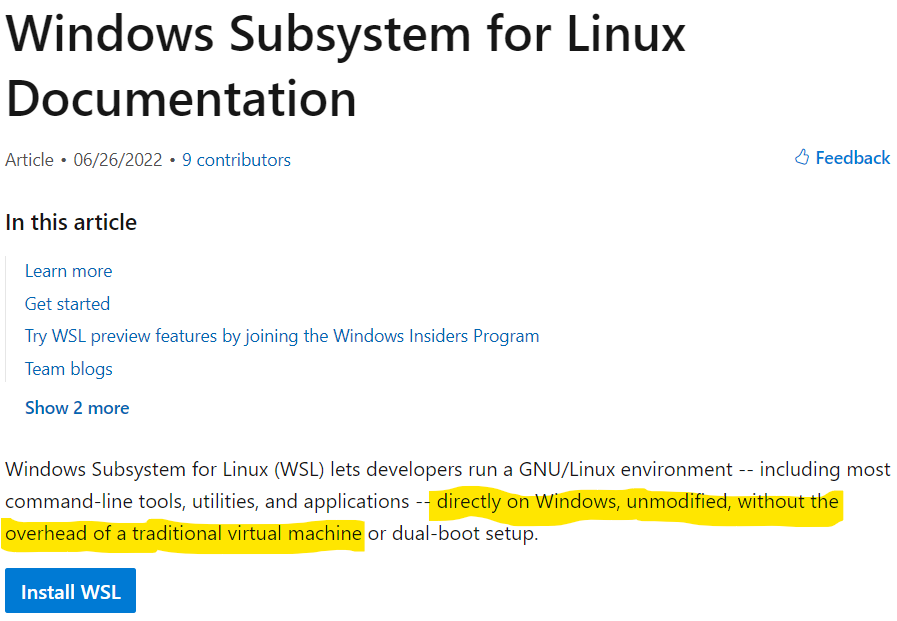

# kali-linux on Windows Subsystem for Linux (WSL)

## WSL documentation

For users running on Windows 10 / 11 there is support out of the box already for WSL: https://docs.microsoft.com/en-us/windows/wsl




## Windows App Store

All the kernels are directly supported and **patched** by the vendors on Microsoft App Store: https://www.microsoft.com/en-us/p/kali-linux/9pkr34tncv07


## Installing VirtualBox and Kali

Instalation is as simple as the command below (that's it, nothing else): 
```
wsl --install -d kali-linux
```


Then, update the packages needed by **CodePath**: https://github.com/0xrutvij/wpVSkali/blob/main/Dockerfile#L10
```
apt install aircrack-ng crackmapexec crunch curl dirb dirbuster dnsenum dnsrecon dnsutils dos2unix enum4linux exploitdb ftp git gawk gobuster hashcat hping3 hydra impacket-scripts john joomscan masscan metasploit-framework mimikatz nano nasm ncat netcat-traditional nikto nmap patator iputils-ping php powersploit proxychains python3-impacket python3-pip python2 python3 recon-ng responder samba samdump2 smbclient smbmap snmp socat sqlmap sslscan theharvester vim wafw00f weevely wfuzz wget whois wordlists wpscan -y --no-install-recommends
```

## Fully supported by developers

Fully suported by **kali.org**: https://www.kali.org/docs/wsl


## Docker support

It fully suports **docker** if installed. Not only that but on windows the prefered virtualization engine is WSL: https://docs.docker.com/desktop/windows/wsl


## Full host integration

No need to mount to comunicate to the host, see bellow. Full clipboard (copy/paste) integration. Multiple GUIs support via Kali Desktop Experience (**kex**): https://www.kali.org/docs/wsl/win-kex


