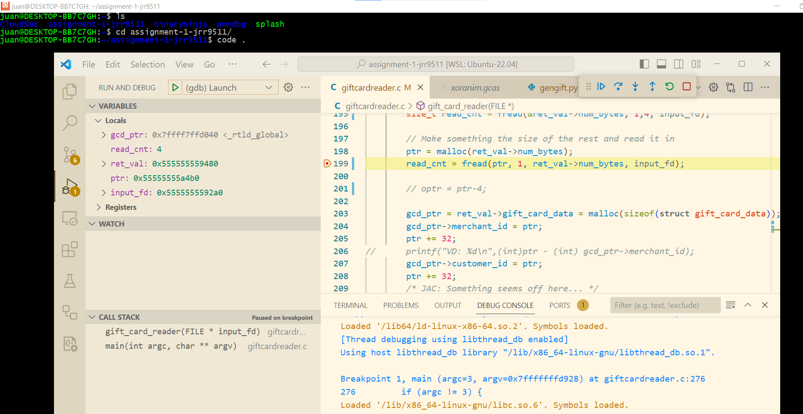

# Ubuntu on Windows Subsystem for Linux (WSL)

## WSL documentation

For users running on Windows 10 / 11 there is support out of the box already for WSL: <a href="https://docs.microsoft.com/en-us/windows/wsl" target="_blank">https://docs.microsoft.com/en-us/windows/wsl</a>


## Windows App Store

All the kernels are directly supported and **patched** by the vendors on Microsoft App Store: <a href="https://apps.microsoft.com/store/detail/ubuntu-22042-lts/9PN20MSR04DW" target="_blank">https://apps.microsoft.com/store/detail/ubuntu-22042-lts/9PN20MSR04DW</a>


## Installing WSL2 and Ubuntu

Just hover over the 'Windows Subsystem for Linux' tile, click on 'Get' button, then follow the instructions. You would probably need to admin rigths and most likely will need to reboot.
Then you can install Ubuntu 22.04.2 LTS (as of now it is the latest LTS), hover over the tile, click on 'Get' button, then follow the instructions. You do not need admin rigths and not need to reboot.

The advantage of doing it with the app store is that you will get automatic updates both for WSL and Ubuntu. BTW, I also installed Visual Studio Code via the app store to get automatic updates as well.

NOTE: You can do all that from the command line with out using the app store, there are instructions on the above links, but why go tru the hasle.


## Fully supported by Canonical

Fully suported by **canonical.com**: <a href="https://ubuntu.com/wsl" target="_blank">https://ubuntu.com/wsl</a>

The link above provides plenty of documentation if needed: installation on WSL2, using GPU for machine learning, using VS Code, etc.


## Visual Studio Code

Just install VS Code also from the app store, and follow these tutorials:
- <a href="https://ubuntu.com/tutorials/working-with-visual-studio-code-on-ubuntu-on-wsl2" target="_blank">https://ubuntu.com/tutorials/working-with-visual-studio-code-on-ubuntu-on-wsl2</a> Only follow steps 1-4, the rest of the steps are for NodeJS.
- <a href="https://code.visualstudio.com/docs/languages/cpp" target="_blank">https://code.visualstudio.com/docs/languages/cpp</a> read, go to 'Go to the GCC tutorial'
- <a href="https://code.visualstudio.com/docs/cpp/config-linux" target="_blank">https://code.visualstudio.com/docs/cpp/config-linux</a>

Now you have your C/C++ Ubuntu environment fully integrated with VS Code: full debugging, syntax highling, etc. 

Just open Ubuntu and from the shell clone your git repo and from the repo just type: 

```
code .
```




## Full host integration

No need to mount to comunicate to the host, see bellow. Full clipboard (copy/paste) integration. Multiple GUIs support via Kali Desktop Experience (**kex**): https://www.kali.org/docs/wsl/win-kex


